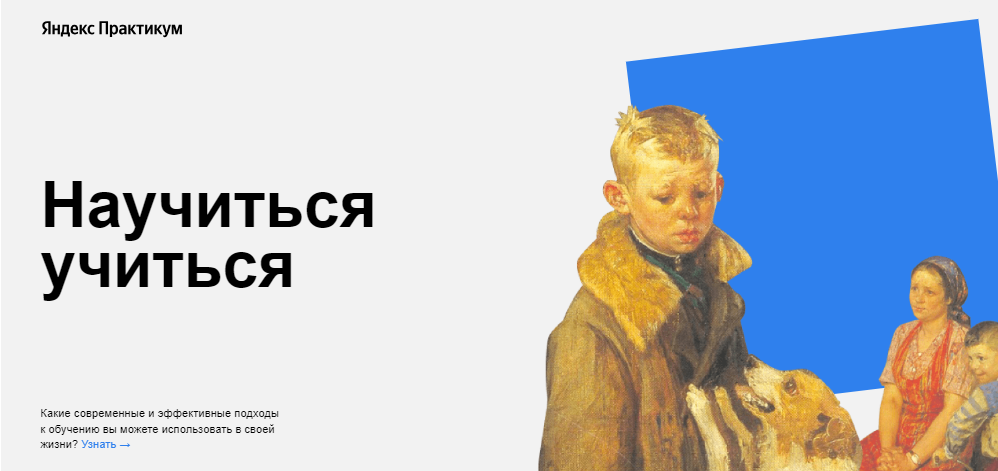

# Научиться учиться от _"Yandex Practicum"_.

Проект направлен на представление эффективных методов обучения, чтобы помочь пользователям преодолеть проблемы в учебном процессе. Он содержит секции, посвященные главным проблемам в обучении, эффективным техникам обучения, видеоматериалам для борьбы с прокрастинацией, истории успеха Барбары Оакли, методу "Фейнмана", интересным цифрам и фактам о мозге и обучении, а также информацию о вкладе Салмана Хана и принципах обучения от Джоша Кауфмана. Этот проект направлен на то, чтобы помочь пользователям понять и использовать эффективные методы обучения. [Ссылка на gh-pages](https://dmitry145528.github.io/how-to-learn/)



## Структура проекта:

* Шапка: Логотип, заголовок и подзаголовок, привлекающие внимание и описывающие цель проекта.

* Главная секция: Информация о главных проблемах в обучении и неэффективных методах учебы.

* Секция с техниками обучения: Предлагает пять эффективных техник обучения, предложенных Барбарой Оакли.

* Секция с видео: Содержит два видео на платформе TED для тех, кто прокрастинирует.

* Секция с историей Барбары Оакли: Рассказывает историю успешного преодоления проблем в учебе.

* Секция о методе Фейнмана: Предлагает метод "Фейнмана" для понимания и запоминания материала.

* Секция с цифрами и фактами: Представляет интересные данные о мозге, обучении и образовании.

* Секция о Салмане Хане: Содержит информацию о его вкладе в процесс обучения и книгу "Весь мир — школа".

* Секция о принципах обучения от Джоша Кауфмана: Основные принципы обучения, предложенные Джошем Кауфманом.

## Что сделал:

* Разработал структура проекта "Научиться учиться от Yandex Practicum".

* Создал HTML и CSS файлы для построения страницы проекта.

* Вставил изображения и контент, соответствующие каждой секции проекта.

* Добавил интерактивные элементы для улучшения пользовательского опыта.

* Оптимизировал загрузка и производительность страницы.

## Реализованный функционал:

* Реализована возможность просмотра видеоматериалов на странице через встроенные плееры с использованием технологии iframe.

* Добавлены анимационные эффекты для улучшения визуального восприятия пользователем. Эти эффекты активируются при наведении мыши на определенные элементы или при загрузке страницы, что делает интерфейс более привлекательным.

* Произведено форматирование текста, изображений и других элементов для создания удобного и эстетичного визуального восприятия страницы. Элементы расположены таким образом, чтобы обеспечить понятную и легко читаемую структуру контента.

## Технологии:

* Технология ___Flex-вёрстка___.
* Технология ___@keyframes___.
* Технология для вставки видео ___iframe___.
* Технология анимации ___rotate___ с помощью @keyframes.
* Технология псевдокласса ___:hover___.
* Технология позиционирования элементов.
* Технология ___БЭМ (Nested)___.

## Инструкция по запуску:

1. **Склонировать репозиторий:**
   ```sh
   git clone git@github.com:Dmitry145528/how-to-learn.git

2. Перейдите в папку с проектом, затем откройте файл index.html в вашем любимом браузере.
